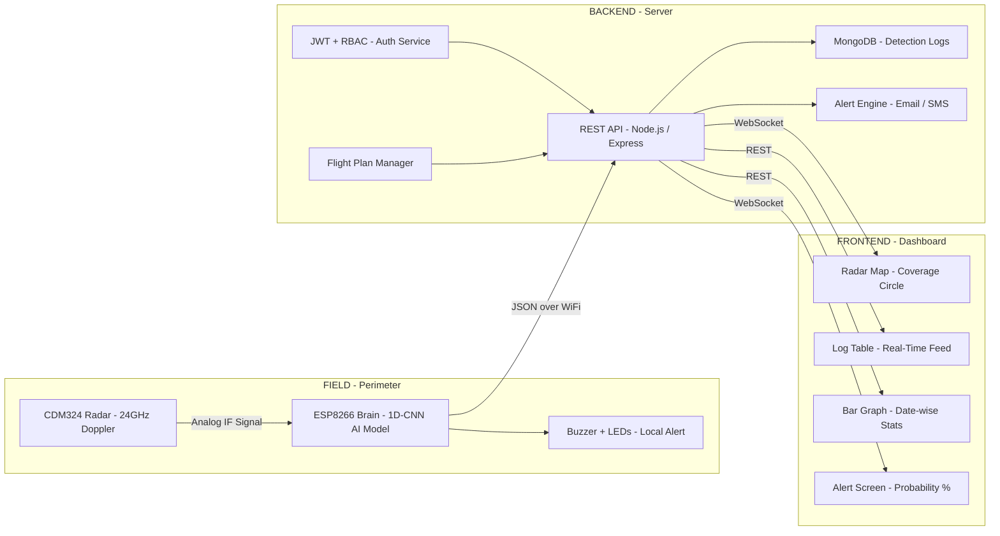
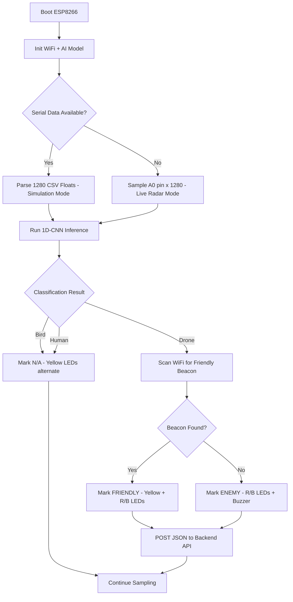
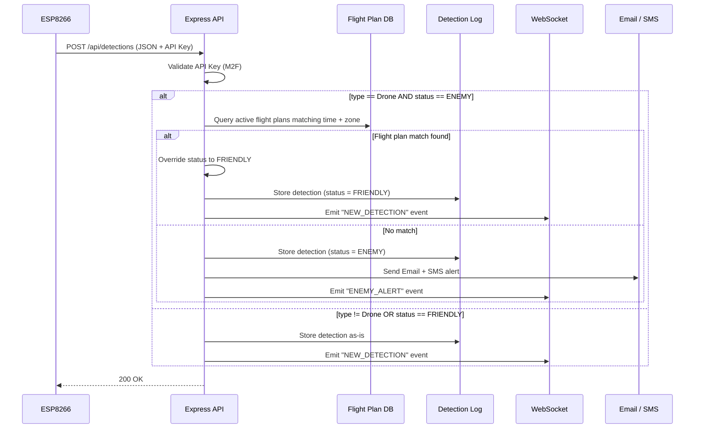
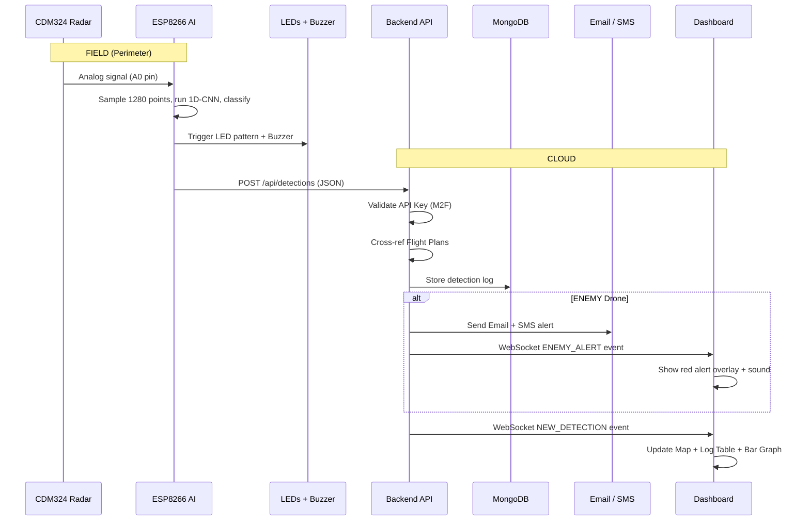

# PROJECT E.C.H.O. — System Architecture & Workflow

> **E**dge **C**omputing **H**ardware for **O**verhead-observation  
> End-to-end system design document covering firmware, backend, frontend, and research.

---

## System Overview



---

## HARDWARE — Radar and Signal Conditioning

### Current Approach: Simulation

The system is currently running in simulation mode. The ESP8266 receives pre-recorded radar signatures (1280 or 192 comma-separated float values) via the Serial Monitor. These signatures were extracted from the Zenodo 77GHz FMCW radar research dataset and mathematically scaled to simulate 24GHz Doppler responses.

This allows the full AI pipeline (inference, classification, alerting) to be tested and demonstrated without physical radar hardware.

### Target Hardware: CDM324 (24GHz CW Doppler Radar)

The CDM324 is a low-cost continuous-wave Doppler radar module operating at 24.125 GHz. It detects moving objects by measuring the frequency shift (Doppler effect) of the reflected microwave signal. Drone propellers produce a distinctive micro-Doppler signature in the 100-300 Hz range that our 1D-CNN is trained to recognize.

**Why CDM324 over HB100 (10.525 GHz):**
- Higher frequency means higher sensitivity to small, fast-moving targets like drone propellers.
- The micro-Doppler resolution at 24GHz is approximately 2.3x better than at 10.5GHz for the same propeller speed.
- The CDM324 module is physically smaller and draws less current.

### Signal Conditioning Circuit (CDM324 to ESP8266)

The CDM324 outputs a raw analog IF (Intermediate Frequency) signal in the millivolt range. The ESP8266 A0 pin expects 0 to 1V. An op-amp pre-amplifier is required to boost the signal.

**Circuit: LM358 Non-Inverting Amplifier**

```
CDM324 IF Output ──┬── R1 (10k) ── GND
                   │
                   └── (+) LM358 Op-Amp
                              │
                        (-) ──┤── R2 (100k) ── Output ── ESP8266 A0
                              │
                              └── R3 (10k) ── GND
                              
Gain = 1 + (R2 / R3) = 1 + (100k / 10k) = 11x amplification
```

This boosts the CDM324's millivolt-level output to approximately 0.5 to 0.8V, which is well within the ESP8266 A0 input range (0 to 1V).

**Power:** The LM358 runs on 3.3V or 5V from the NodeMCU's power rail. The CDM324 requires a clean 5V supply.

### Wiring Summary

| Component | Pin | Connects To |
|:---|:---|:---|
| CDM324 IF output | IF | LM358 non-inverting input (+) |
| LM358 output | OUT | ESP8266 A0 (analog input) |
| CDM324 VCC | 5V | NodeMCU VIN (5V USB rail) |
| CDM324 GND | GND | Common ground |
| LM358 VCC | 3.3V or 5V | NodeMCU 3V3 or VIN |
| Buzzer | Signal | GPIO 14 (D5) |
| Yellow LED 1 | Anode | GPIO 5 (D1) via 220 ohm resistor |
| Yellow LED 2 | Anode | GPIO 4 (D2) via 220 ohm resistor |
| Red LED | Anode | GPIO 12 (D6) via 220 ohm resistor |
| Blue LED | Anode | GPIO 13 (D7) via 220 ohm resistor |
| OLED SDA | SDA | GPIO 0 (D3) |
| OLED SCL | SCL | GPIO 2 (D4) |

### Component List (Bill of Materials)

| Component | Quantity | Approximate Cost (INR) | Source |
|:---|:---|:---|:---|
| NodeMCU ESP8266 v3 | 1 | 160 to 250 | Robu.in, Zbotic |
| CDM324 24GHz Radar Module | 1 | approximately 1,250 | Flyrobo, Probots, IndiaMART |
| LM358 Op-Amp IC | 1 | 5 to 25 | Local shops, IndiaMART |
| SSD1306 OLED Display (128x64, I2C) | 1 | 110 to 300 | Probots, Robu.in, Quartz Components |
| ESP-01 Module (Friendly Drone Tag) | per drone | 90 to 150 | Robu.in, ElectronicsComp, Zbotic |
| Active Buzzer (5V) | 1 | 8 to 40 | Local shops, online retailers |
| LEDs 5mm (Yellow x2, Red x1, Blue x1) | 4 | 1 to 10 each (4 to 40 total) | Bulk packs available for under 1 per LED |
| 220 ohm Resistors | 4 | 1 to 2 each (4 to 8 total) | Local shops |
| 10k and 100k Resistors (for LM358) | 3 | 1 to 2 each (3 to 6 total) | Local shops |
| Breadboard + Jumper Wires | 1 set | 80 to 150 | Robu.in, Probots |
| **Total (single node, excluding drone tags)** | | **approximately 1,620 to 2,070** |

### Mathematical Basis: 24GHz Doppler Detection

The Doppler frequency shift for a target moving at velocity v:

```
fd = (2 * v * f0) / c

Where:
  fd = Doppler frequency shift (Hz)
  v  = target velocity (m/s)
  f0 = radar carrier frequency (24.125 GHz)
  c  = speed of light (3 x 10^8 m/s)
```

For a drone propeller tip moving at 50 m/s:
```
fd = (2 * 50 * 24.125e9) / 3e8 = 8041 Hz
```

This falls well within the ESP8266 A0 sampling capability (approximately 10 kHz with `analogRead()`). The 1D-CNN model is trained to recognize the harmonic pattern of these propeller-tip frequencies, which is distinct from bird wing flaps (lower frequency, irregular) and walking humans (very low frequency, broad).

### Transition from Simulation to Live Hardware

1. Assemble the LM358 amplifier circuit on a breadboard.
2. Connect CDM324 IF output through the amplifier to ESP8266 A0.
3. The existing firmware (v6.0) already supports live sampling from A0 — no code changes needed.
4. Run a baseline calibration (the firmware does this automatically on boot with 20 frames).
5. Place the radar module facing a drone flight path and observe Serial Monitor output.

---

## MODULE 1: THE BRAIN (ESP8266 Firmware) — Team 1

### JSON Output Format

This is the structure the ESP8266 sends to the backend server over HTTP POST whenever a classification event occurs.

```json
{
  "node_id": "ECHO-01",
  "type": "Drone",
  "confidence": 97.4,
  "status": "ENEMY",
  "timestamp": 1712165400,
  "rssi": -45
}
```

| Field | Type | Description |
|:---|:---|:---|
| `node_id` | string | Unique ID of the radar node (e.g., `ECHO-01`) |
| `type` | string | AI classification result: `Bird`, `Drone`, or `Human` |
| `confidence` | float | Probability percentage from the softmax output (0 to 100) |
| `status` | string | `ENEMY` or `FRIENDLY` (determined by beacon scan result) |
| `timestamp` | int | Unix timestamp at the moment of detection |
| `rssi` | int | WiFi signal strength at the time of transmission |

### LED and Buzzer Behaviour

| State | Yellow LEDs (x2) | Red LED | Blue LED | Buzzer |
|:---|:---|:---|:---|:---|
| **IDLE** (no detection) | Alternate blinking | OFF | OFF | OFF |
| **ENEMY drone detected** | OFF | Alternates with Blue | Alternates with Red | Pattern: `11011011011011` |
| **FRIENDLY drone detected** | ON (steady) | Alternates with Blue | Alternates with Red | OFF |

### Firmware Flow



### Friend or Foe (IFF) Identification

The system uses a Digital Handshake method to distinguish friendly drones from enemy intruders, leveraging the ESP8266's built-in WiFi.

**The Drone Tag (ESP-01 Broadcaster):**
- A tiny ESP-01 module (approximately 1.5 grams) is attached to each friendly drone's frame.
- It is powered from the drone's existing 5V battery rail (flight controller power bus).
- The ESP-01 is programmed in AP Mode (Access Point). It does not connect to the internet — it simply broadcasts a hidden SSID such as `ECHO_FRIENDLY_01`.
- For commercial drones (e.g., DJI), the existing RemoteID broadcast over WiFi/Bluetooth can be sniffed instead of requiring a separate tag.

**The Ground Node Scan (ESP8266 Listener):**
- When the 1D-CNN classifies a target as "Drone", the ESP8266 immediately runs `WiFi.scanNetworks()`.
- It compares discovered SSIDs against a whitelist of known friendly beacon names.
- If a match is found: status = `FRIENDLY`. If no match: status = `ENEMY`.

**Backend Cross-Reference (Flight Plans):**
- Even if the WiFi beacon scan fails (drone out of range), the backend performs a secondary check against active Flight Plans uploaded by the admin (see Flight Plan format below).
- If the detection falls within an authorized time window and geographic zone, the status is overridden to `FRIENDLY`.

**Range Considerations:**
- Standard ESP-01 + NodeMCU: reliable up to approximately 100 meters altitude.
- With a high-gain SMA antenna (5dBi or 8dBi) on the ground node: 300 to 500 meters.
- For ranges beyond 1km: swap ESP-01 tag for a LoRa beacon module (future scope).

### OLED Local Dashboard Display

In addition to the web dashboard (Team 3), the ESP8266 ground node can drive a small SSD1306 OLED display (128x64 pixels, I2C) to show real-time status directly on the hardware unit. This allows field operators to monitor the node without needing a laptop or phone.

**OLED Layout — Idle State:**
```
+---------------------------+
| E.C.H.O. Node: ECHO-01   |
| Status: IDLE              |
|                           |
| Last: Bird  (88.1%)       |
| Enemies today: 0          |
+---------------------------+
```

**OLED Layout — Enemy Detected:**
```
+---------------------------+
| *** ENEMY DETECTED ***    |
| Type: Drone               |
| Confidence: 97.4%         |
| Status: ENEMY             |
| Streak: 3                 |
+---------------------------+
```

---

## MODULE 2: THE BACKEND (Node.js + Express) — Team 2

### Tech Stack

| Component | Technology |
|:---|:---|
| Runtime | Node.js 18+ |
| Framework | Express.js |
| Database | MongoDB (Atlas or local) |
| Auth | JWT (jsonwebtoken) + bcrypt |
| Real-time | Socket.io (WebSocket) |
| Email Alerts | Nodemailer (SMTP) or SendGrid |
| SMS Alerts | Twilio API |

### API Endpoints

#### Authentication (JWT + Role-Based Access)

| Method | Endpoint | Role | Description |
|:---|:---|:---|:---|
| `POST` | `/api/auth/register` | Public | Register new user (default role: `viewer`) |
| `POST` | `/api/auth/login` | Public | Returns JWT token |
| `GET` | `/api/auth/me` | Any | Get current user info |

#### Roles

| Role | Permissions |
|:---|:---|
| `admin` | Full access: manage users, flight plans, view all logs, configure alerts |
| `operator` | View dashboard, acknowledge alerts, view logs |
| `viewer` | Read-only access to map and logs |

#### Detection Ingestion (JSON from Brain)

| Method | Endpoint | Auth | Description |
|:---|:---|:---|:---|
| `POST` | `/api/detections` | API Key (M2F) | Receive JSON payload from ESP8266 |
| `GET` | `/api/detections` | JWT | Get all detections (paginated) |
| `GET` | `/api/detections/stats` | JWT | Date-wise detection counts for bar graph |

**Note on M2F (Machine-to-Firewall):** The ESP8266 authenticates with a pre-shared API key sent in the `X-API-Key` header instead of JWT. This avoids implementing a full login flow on a device with only 80KB of RAM.

#### Flight Plan Manager (Admin Only)

| Method | Endpoint | Role | Description |
|:---|:---|:---|:---|
| `POST` | `/api/flightplans` | `admin` | Upload a new flight plan |
| `GET` | `/api/flightplans` | `admin`, `operator` | List active flight plans |
| `DELETE` | `/api/flightplans/:id` | `admin` | Remove a flight plan |

**Flight Plan JSON Format:**

```json
{
  "plan_id": "FP-2026-04-03-001",
  "drone_callsign": "ALPHA-7",
  "operator": "Lt. Kumar",
  "start_time": "2026-04-03T06:00:00Z",
  "end_time": "2026-04-03T08:00:00Z",
  "zone": {
    "center_lat": 28.6139,
    "center_lng": 77.2090,
    "radius_m": 500
  },
  "beacon_ssid": "FRIENDLY_ECHO_ALPHA7",
  "status": "ACTIVE"
}
```

**Important:** When a detection arrives, the backend checks whether a matching active flight plan exists (checking for time window overlap and zone match). If a match is found, the `status` field is automatically overridden from `ENEMY` to `FRIENDLY` before the log is stored.

#### Beacon Whitelist (For ESP8266 Sync)

| Method | Endpoint | Role | Description |
|:---|:---|:---|:---|
| `GET` | `/api/beacons` | API Key (M2F) | Returns list of friendly SSIDs so ESP8266 can sync its local whitelist on boot |
| `POST` | `/api/beacons` | `admin` | Add a new friendly beacon SSID |
| `DELETE` | `/api/beacons/:id` | `admin` | Remove a beacon from the whitelist |

On boot, the ESP8266 calls `GET /api/beacons` and stores the SSID list in memory. When it detects a drone, it scans WiFi and compares against this local copy. This way, the admin can add or remove friendly drones from the web dashboard without reflashing the ESP8266.

#### IFF Cross-Reference Logic (Runs on Every Detection)

When `POST /api/detections` receives a payload from the ESP8266, the server executes the following logic before storing the log:

```
RECEIVE detection payload from ESP8266:
  { node_id, type, confidence, status, timestamp }

IF detection.type != "Drone":
    Store as-is, skip IFF check
    RETURN

-- Step 1: Check if ESP8266 already resolved it --
IF detection.status == "FRIENDLY":
    Store as-is (ESP8266 found a matching beacon via WiFi scan)
    RETURN

-- Step 2: Backend fallback — cross-reference flight plans --
QUERY all flight plans WHERE:
    status == "ACTIVE"
    AND start_time <= detection.timestamp <= end_time
    AND haversine_distance(node_location, zone.center) <= zone.radius_m

IF matching flight plan found:
    OVERRIDE detection.status = "FRIENDLY"
    SET detection.flight_plan_match = matching_plan.plan_id
    Store detection log
    Emit WebSocket "NEW_DETECTION" (no alert)
    RETURN

-- Step 3: No match found — confirmed enemy --
Store detection log with status = "ENEMY"
Send Email alert to admin
Send SMS alert via Twilio
Emit WebSocket "ENEMY_ALERT" to all dashboards
```

#### Alert Engine

| Method | Endpoint | Role | Description |
|:---|:---|:---|:---|
| `GET` | `/api/alerts` | JWT | Get alert history |
| `POST` | `/api/alerts/acknowledge/:id` | `operator` | Mark alert as acknowledged |

**Alert Trigger Logic:**
```
IF detection.type == "Drone" AND detection.status == "ENEMY":
    Send Email to admin@echo-defense.in
    Send SMS to configured phone number via Twilio
    Emit WebSocket event "ENEMY_ALERT" to all connected dashboards
```

Alerts are only sent when a drone detection passes through both the ESP8266 beacon scan and the backend flight plan check without being resolved as friendly. This two-layer approach minimizes false alarms.

### Backend Data Flow



### MongoDB Collections

```javascript
// users
{
  _id: ObjectId,
  username: String,
  email: String,
  password_hash: String,
  role: String,           // "admin", "operator", or "viewer"
  created_at: Date
}

// detections
{
  _id: ObjectId,
  node_id: String,        // e.g., "ECHO-01"
  type: String,           // "Bird", "Drone", or "Human"
  confidence: Number,     // 0 to 100
  status: String,         // "ENEMY", "FRIENDLY", or "NORMAL"
  timestamp: Date,
  rssi: Number,
  flight_plan_match: String,  // null or the matching plan_id
  acknowledged: Boolean,
  acknowledged_by: String
}

// flight_plans
{
  _id: ObjectId,
  plan_id: String,        // e.g., "FP-2026-04-03-001"
  drone_callsign: String, // e.g., "ALPHA-7"
  operator: String,       // e.g., "Lt. Kumar"
  start_time: Date,
  end_time: Date,
  zone: {
    center_lat: Number,
    center_lng: Number,
    radius_m: Number
  },
  beacon_ssid: String,    // e.g., "FRIENDLY_ECHO_ALPHA7"
  status: String          // "ACTIVE", "EXPIRED", or "CANCELLED"
}

// beacon_whitelist
{
  _id: ObjectId,
  ssid: String,           // e.g., "ECHO_FRIENDLY_01"
  drone_callsign: String, // e.g., "ALPHA-7"
  added_by: String,       // admin username
  active: Boolean
}

// alerts
{
  _id: ObjectId,
  detection_id: ObjectId,
  alert_type: String,     // "email", "sms", or "both"
  sent_to: String,
  acknowledged: Boolean,
  acknowledged_by: String,
  timestamp: Date
}
```

---

## MODULE 3: THE FRONTEND (Dashboard) — Team 3

### 1. Radar Map

| Feature | Implementation |
|:---|:---|
| Map Library | Leaflet.js (open-source, no API key needed) |
| Radar Circle | `L.circle([lat, lng], {radius: 500})` renders a semi-transparent green area |
| Node Marker | Pulsing dot at center showing node status (Green = Active, Red = Alert) |
| Detection Pin | Red pin appears at estimated direction when a drone is detected |

**Data Source:** `GET /api/detections` combined with WebSocket `NEW_DETECTION` events for real-time updates.

### 2. Log Table

| Column | Source |
|:---|:---|
| Timestamp | `detection.timestamp` (formatted to human-readable) |
| Node ID | `detection.node_id` |
| Target Type | `detection.type` (displayed with a colored badge: Red for Drone, Green for Bird, Blue for Human) |
| Confidence | `detection.confidence` shown as percentage |
| Status | `detection.status` (Red badge for ENEMY, Green badge for FRIENDLY) |
| Action | Acknowledge button (visible only to operators and admins) |

**Data Source:** `GET /api/detections?page=1&limit=50` combined with real-time WebSocket push for new entries.

### 3. Bar Graph (Date-wise Detection Stats)

| Feature | Implementation |
|:---|:---|
| Chart Library | Chart.js |
| X-Axis | Dates (configurable: last 7, 14, or 30 days) |
| Y-Axis | Count of detections |
| Bars | Stacked by category: Enemy Drones, Friendly Drones, Birds, Humans |
| Filter | Dropdown to select time range |

**Data Source:** `GET /api/detections/stats?range=7d`

**Expected Response:**
```json
[
  {"date": "2026-04-01", "enemy_drones": 3, "friendly_drones": 1, "birds": 12, "humans": 2},
  {"date": "2026-04-02", "enemy_drones": 0, "friendly_drones": 2, "birds": 8,  "humans": 1}
]
```

### 4. Alert Screen

| Feature | Description |
|:---|:---|
| Trigger | Fires on WebSocket event `ENEMY_ALERT` |
| Visual | Full-screen red overlay with a pulsing animation |
| Content | Displays: target type, confidence percentage, node ID, timestamp |
| Sound | Browser audio alert plays when triggered |
| Dismiss | "Acknowledge" button sends `POST /api/alerts/acknowledge/:id` |

### Frontend Layout (Wireframe)

```
+-----------------------------------------------------+
|  E.C.H.O. Command Center          [Admin v] [Bell]  |
+----------------------+------------------------------+
|                      |                              |
|   RADAR MAP          |   BAR GRAPH                  |
|   (Leaflet.js)       |   (Chart.js)                |
|   [Green Circle]     |   [Stacked Bars]            |
|   [Detection Pins]   |                              |
|                      |                              |
+----------------------+------------------------------+
|                                                     |
|   DETECTION LOG TABLE                               |
|   Time | Node | Type | Confidence | Status | Action |
|   ------------------------------------------------- |
|   21:04 | ECHO-01 | Drone | 97.4% | ENEMY  | [Ack] |
|   21:02 | ECHO-01 | Bird  | 88.1% | N/A    | ---   |
|   20:58 | ECHO-01 | Human | 91.2% | N/A    | ---   |
|                                                     |
+-----------------------------------------------------+

         +------- ALERT OVERLAY (on ENEMY) -------+
         |                                         |
         |   ** ENEMY DRONE DETECTED **            |
         |                                         |
         |   Node:       ECHO-01                   |
         |   Confidence:  97.4%                    |
         |   Time:        21:04:33 IST             |
         |                                         |
         |          [ ACKNOWLEDGE ]                 |
         |                                         |
         +-----------------------------------------+
```

---

## FULL SYSTEM DATA FLOW



---

## TEAM TASK CHECKLIST

### Team 1 — Embedded AI
- [x] Train 1D-CNN on Zenodo 77GHz FMCW dataset
- [x] Apply 24GHz spectral scaling (factor 0.311)
- [x] Export model as `.h5` and `.tflite`
- [x] ESP8266 firmware compiled and uploaded (v6.0, Chirale_TensorFlowLite)
- [x] Implement LED patterns (2x Yellow, 1x Red, 1x Blue, Buzzer with SOS morse)
- [x] Activity gating and enemy streak filter
- [ ] WiFi beacon scan for IFF (scan SSIDs after drone detection)
- [ ] Program ESP-01 tags for friendly drones (AP mode with hidden SSID)
- [ ] OLED display integration (SSD1306 128x64, I2C)
- [ ] Add WiFi POST to backend API (HTTP with X-API-Key header)
- [ ] Test with `test_drone.csv` and `test_bird.csv` simulation strings

### Team 2 — Backend Cloud
- [ ] Set up Node.js + Express project
- [ ] MongoDB schema (users, detections, flight_plans, alerts)
- [ ] JWT authentication + role-based middleware
- [ ] `POST /api/detections` endpoint (M2F with API key)
- [ ] Flight plan CRUD (admin only)
- [ ] Friend/Foe cross-reference logic
- [ ] Email alerts (Nodemailer/SendGrid)
- [ ] SMS alerts (Twilio)
- [ ] WebSocket events (Socket.io)
- [ ] Detection stats aggregation endpoint

### Team 3 — Frontend Dashboard
- [ ] Radar map with Leaflet.js (coverage circle + detection pins)
- [ ] Log table (real-time via WebSocket)
- [ ] Bar graph with Chart.js (date-wise enemy/friendly/bird/human)
- [ ] Alert screen overlay (full-screen red + acknowledge button)
- [ ] Login page (JWT auth)
- [ ] Role-based UI (admin vs operator vs viewer)

### Team 4 — Patent Research and Documentation
- [x] Patent comparison (GB2536043A, US10739451B1, US20230401943A1, etc.)
- [ ] Final technical report
- [ ] PowerPoint presentation
- [ ] Novelty justification (low-cost edge AI vs. expensive military systems)

---

**Note for Team 2:** The ESP8266 sends a simple HTTP POST with an `X-API-Key` header. JWT is not used on the microcontroller side because the device only has 80KB of RAM. JWT authentication is strictly for human users on the dashboard.
